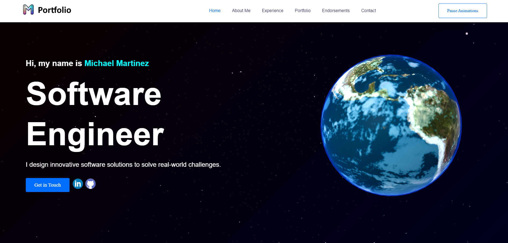
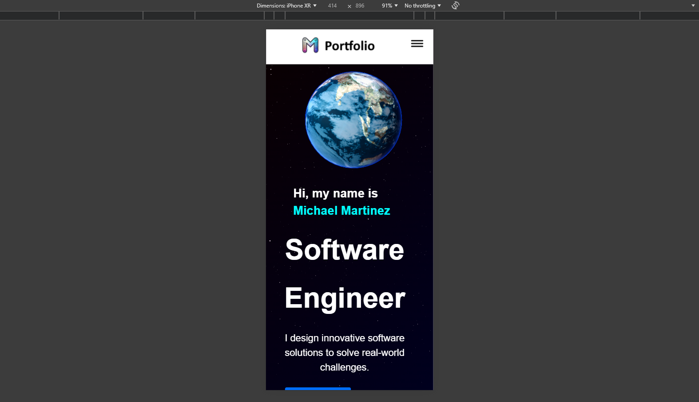

## Portfolio Website

### Overview

A personal portfolio website showcasing different sections about myself, my experience, projects, testimonials,
and a contact form with stunning 3D visuals. Built using modern web technologies to create a professional and
responsive single-page application.

## Features

- **Responsive Design:** Ensures a seamless experience across devices.
- **Interactive 3D Effects:** Engaging starry background and 3D Earth model using Three.js.
- **Contact Form:** Reach out to me directly via the contact form.
- **Accessibility:** Compliant with WCAG Level A standards.
- **Automated Testing:** Front-end tested using Playwright for reliable performance and functionality.
- **Database Integration:** MySQL database saves all submissions from the contact form.
- **Deployment:** To be hosted on AWS Lightsail with security implementations to safeguard data and ensure robust access
  control.

## Sections

* **Navbar**
    - Contains logo and website navigation.
* **Hero**
    - Short introduction with interactive Earth model.
* **About Me**
    - Background information of myself.
* **Experience**
    - Professional experience and tech stack.
* **Portfolio**
    - List of projects I've worked and saved on my github.
* **Endorsements**
    - Recommendations from colleagues.
* **Contact Me**
    - Contact form to submit information to my email and database.

## Tech Stack

- **Frontend:** React, Vite, Three.js, HTML, CSS, JavaScript
- **Backend:** Spring Boot, MySQL
- **Deployment:** AWS Lightsail, Netlify

## Installation & Setup

Clone the repository and install dependencies:

- git clone https://github.com/michaelm4320/portfolio-website.git
- cd portfolio-website
- npm install
- npm run dev

## CI/CD Pipeline

This CI/CD pipeline automates the process of building and deploying your project. Here's a simple breakdown of what each
part does:

### Backend Build

1. **Checkout Code**
    - Fetches the latest code from your GitHub repository.

2. **Set up JDK 17**
    - Installs Java Development Kit (JDK) version 17.

3. **Set up Maven**
    - Installs Maven, a build tool for Java projects.

4. **Build Backend**
    - Compiles and packages your backend code into a JAR file, skipping tests for faster builds.

5. **Inspect JAR Contents**
    - Lists the contents of the generated JAR file to ensure it's correct.

6. **Create SSH Private Key File**
    - Creates a file from the SSH private key stored in GitHub secrets for secure access to the deployment server.

7. **Add AWS Lightsail Host Key**
    - Adds the deployment server’s SSH key to known hosts to prevent SSH warnings during deployment.

8. **Deploy Backend to AWS Lightsail**
    - Removes the old JAR file from the server, copies the new JAR file to the server, and restarts the backend service
      with the new JAR.

### Frontend Build

1. **Checkout Code**
    - Fetches the latest code from your GitHub repository.

2. **Set up Node.js**
    - Installs Node.js version 16, needed for building the frontend.

3. **Install Dependencies**
    - Installs JavaScript libraries required for your frontend.

4. **Build Frontend**
    - Compiles and builds the frontend code into static files.

5. **Start Frontend Server**
    - Starts the frontend development server to serve your static files.

6. **Wait for Frontend Server to be Ready**
    - Waits until the frontend server is up and running.

7. **Install Playwright Browsers**
    - Installs the necessary browsers for Playwright testing.

8. **Run Playwright Tests**
    - Executes automated tests using Playwright to ensure the frontend works correctly.

## `package.json` Overview

The `package.json` file is a crucial part of any Node.js project. It contains metadata about the project,
including its dependencies, scripts, and configuration. In this project, `package.json` has been configured to
handle various tasks related to development and testing.

## Spring Boot

To run Spring Boot, run `mvn.cmd spring-boot:run` on the terminal in root.

## Scripts

The `scripts` section in `package.json` allows you to define commands that can be run from the terminal.
Here's an overview of the scripts set up for this project:

- **`dev`**: Runs the Vite development server. Use `npm run dev` to start the development server and view the
  application locally.
- **`test`**: Runs Playwright unit tests. Use `npm run test`.

## Playwright

**Playwright** is used for end-to-end (e2e) testing.

**Running Tests**

- **`npm run test`**

# Tutorials

- https://www.youtube.com/watch?v=_vOInY6SRVE
- https://www.youtube.com/watch?v=FntV9iEJ0tU&
- https://www.youtube.com/watch?v=ugIUObNHZdo